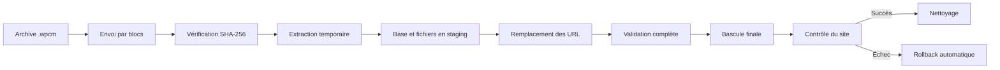

<div align="center">

# Clone Master

### Sauvegarde, migration et restauration WordPress avec validation complète avant bascule

**Une interface guidée pour les débutants. Un moteur de restauration conçu pour résister aux coupures, aux gros sites et aux hébergements WordPress réels.**

<br>


<br>

[Découvrir](#pourquoi-clone-master) ·
[Première sauvegarde](#créer-sa-première-sauvegarde) ·
[Restaurer un site](#restaurer-ou-migrer-un-site) ·
[Comprendre le moteur](#un-moteur-plus-rigoureux-quun-simple-zip) ·
[FAQ](#questions-fréquentes)

</div>

---

## En une minute

Clone Master regroupe le site WordPress dans une archive unique au format `.wpcm`.

Depuis l’administration WordPress, il permet de :

| Besoin | Ce que fait Clone Master |
|---|---|
| Sauvegarder un site | Regroupe la base de données et les fichiers dans une archive contrôlée |
| Changer d’hébergement | Prépare le site sur le nouveau serveur avant la bascule |
| Changer de domaine | Remplace les URL dans les textes et les données sérialisées |
| Reprendre un gros envoi | Repart du dernier bloc déjà reçu et vérifié |
| Éviter un site à moitié restauré | Travaille d’abord dans une zone temporaire |
| Revenir en arrière | Conserve l’ancien état jusqu’à la validation finale |
| Comprendre une erreur | Produit un diagnostic détaillé avec un identifiant unique |

> [!IMPORTANT]
> Une sauvegarde ne doit pas rester uniquement sur le serveur qui héberge le site. Téléchargez le fichier `.wpcm` et conservez au moins une copie sur un autre support.

---

## Pour qui ?

Clone Master a été pensé pour les personnes qui utilisent WordPress sans vouloir manipuler :

- phpMyAdmin ;
- FTP ou SFTP ;
- SSH ;
- des commandes SQL ;
- des archives découpées manuellement ;
- des scripts de remplacement d’URL.

Il convient notamment :

- aux propriétaires de sites WordPress ;
- aux indépendants ;
- aux petites entreprises ;
- aux agences qui gèrent plusieurs sites ;
- aux personnes qui changent d’hébergeur ;
- aux utilisateurs qui veulent tester une restauration avant une intervention importante.

Aucune connaissance en développement n’est nécessaire pour créer ou importer une sauvegarde.

---

## Pourquoi Clone Master ?

De nombreux outils reposent principalement sur un fichier ZIP accompagné d’un export SQL.

Cette méthode peut suffire lorsque tout se déroule parfaitement. Elle devient plus fragile lorsqu’une coupure survient pendant :

- la création de l’archive ;
- son envoi ;
- son extraction ;
- l’import de la base ;
- le remplacement des URL ;
- le remplacement des fichiers ;
- la bascule finale.

Clone Master ne cherche pas seulement à fabriquer un fichier téléchargeable.

Il cherche à répondre à une question plus importante :

> **Le site peut-il être restauré de manière cohérente même si une étape est interrompue ?**

Pour cela, le moteur contrôle chaque phase avant de toucher au site actif.

---

## Créer sa première sauvegarde

<table>
<tr>
<td width="33%" valign="top">

### 1. Ouvrir Clone Master

Installez et activez le plugin, puis ouvrez **Clone Master** dans l’administration WordPress.

</td>
<td width="33%" valign="top">

### 2. Lancer la sauvegarde

Choisissez une sauvegarde manuelle et laissez l’interface suivre automatiquement les différentes étapes.

</td>
<td width="33%" valign="top">

### 3. Télécharger le fichier

Une fois l’opération terminée, téléchargez l’archive `.wpcm` et conservez-la hors du serveur.

</td>
</tr>
</table>

Le fichier obtenu porte un nom commençant par le domaine du site :

```text
monsite.fr-backup-manual-20260725T183500-a1b2c3d4e5f6.wpcm
```

Pour une sauvegarde planifiée :

```text
monsite.fr-backup-auto-20260725T183500-a1b2c3d4e5f6.wpcm
```

Ce nommage permet de reconnaître immédiatement l’origine d’une archive lorsque plusieurs sites sont sauvegardés dans le même dossier.

### Ce que contient une sauvegarde

Selon la configuration choisie, l’archive peut contenir :

- la base de données WordPress ;
- les extensions ;
- les thèmes ;
- les médias ;
- les fichiers du site ;
- les options et réglages ;
- les données des extensions ;
- les informations nécessaires au remplacement des URL et chemins.

Le fichier `.wpcm` ne doit pas être décompressé, renommé pendant son envoi ou modifié manuellement.

---

## Restaurer ou migrer un site

### Avant de commencer

Vérifiez que le serveur de destination dispose de suffisamment d’espace libre pour conserver temporairement :

- le site actuel ;
- l’archive `.wpcm` ;
- les fichiers extraits ;
- la copie préparée ;
- les anciennes et nouvelles tables de base de données.

### Procédure guidée

1. Installez WordPress sur le serveur de destination.
2. Installez et activez Clone Master.
3. Ouvrez l’outil d’importation.
4. Sélectionnez l’archive `.wpcm`.
5. Laissez l’envoi découpé se terminer.
6. Attendez la validation de l’archive.
7. Lancez la restauration.
8. Laissez Clone Master préparer les fichiers et la base.
9. Attendez la fin de la bascule.
10. Reconnectez-vous et contrôlez les pages principales.

> [!WARNING]
> Pour une boutique, un site d’inscription ou un site recevant des formulaires, évitez toute nouvelle activité pendant la bascule finale. Une courte fenêtre de maintenance empêche qu’une commande ou un message soit créé entre la sauvegarde et la restauration.

### Après la restauration

Contrôlez au minimum :

- la page d’accueil ;
- la connexion à l’administration ;
- les permaliens ;
- les images ;
- les formulaires ;
- les comptes utilisateurs ;
- les tâches planifiées ;
- les extensions importantes ;
- les commandes ou données métier, lorsque le site en possède.

---

## Comment se déroule une restauration ?



Tant que les contrôles de préparation ne sont pas terminés, les tables et fichiers existants restent en place.

---

# Un moteur plus rigoureux qu’un simple ZIP

Le moteur de Clone Master repose sur plusieurs mécanismes complémentaires.

## Format `.wpcm` append-only

L’archive est construite selon un principe append-only.

Les nouvelles données sont ajoutées à la suite des blocs déjà écrits et validés. Le moteur évite ainsi de réécrire continuellement les parties précédentes de l’archive.

Cette architecture réduit le risque qu’une interruption survenant à un instant précis rende l’ensemble du fichier incohérent.

## Blocs vérifiés par SHA-256

Les données sont réparties en blocs.

Chaque bloc possède une empreinte SHA-256. Lors de la lecture ou de l’envoi, Clone Master recalcule cette empreinte et vérifie qu’elle correspond à la valeur enregistrée.

Un bloc incomplet, modifié ou corrompu est détecté avant la restauration.

## Reprise exacte après une coupure

Les grandes archives sont envoyées en plusieurs morceaux.

Lorsque la connexion est interrompue, Clone Master peut reprendre à partir du dernier bloc reçu et validé au lieu de renvoyer toute l’archive.

Pour une sauvegarde de plusieurs centaines de mégaoctets, cette différence évite de recommencer inutilement une opération presque terminée.

## Journal de restauration protégé par HMAC

La restauration utilise un journal protégé par HMAC pour mémoriser l’état exact des opérations sensibles.

Ce journal est écrit sur deux emplacements alternés.

Pourquoi deux emplacements ?

Parce qu’un serveur peut s’arrêter au moment précis où le journal est lui-même en cours d’écriture. En alternant les copies, Clone Master conserve une version précédente exploitable lorsque la plus récente est incomplète.

Le mécanisme de récupération peut ainsi déterminer plus sûrement :

- l’étape atteinte ;
- les tables déjà basculées ;
- les fichiers déjà remplacés ;
- l’ancien état disponible ;
- l’action de rollback nécessaire.

## Base importée dans des tables de staging

Clone Master n’importe pas directement la sauvegarde dans les tables utilisées par le site.

Il crée d’abord des tables temporaires, puis vérifie :

- leur présence ;
- leur structure ;
- leur nombre de lignes ;
- leurs références ;
- les valeurs sérialisées ;
- le remplacement des URL ;
- les éléments variables tels que certains compteurs `AUTO_INCREMENT`.

Le site existant reste intact pendant cette préparation.

## Bascule atomique par renommage de préfixes

Une fois les validations terminées, Clone Master effectue une bascule coordonnée par renommage des tables.

L’objectif est d’éviter un état intermédiaire dans lequel :

- certaines tables proviendraient de la sauvegarde ;
- d’autres appartiendraient encore à l’ancien site.

Le moteur conserve l’ancien ensemble le temps de vérifier que le site restauré répond correctement.

## Rollback automatique

Si la restauration finale ne produit pas un site fonctionnel, Clone Master peut rétablir l’ensemble précédent.

Cette architecture apporte une garantie bien supérieure au schéma classique :

```text
extraire un ZIP + importer un dump SQL + espérer que toutes les étapes se terminent
```

---

## Données sérialisées WordPress

WordPress et de nombreuses extensions enregistrent des tableaux et objets sous une forme sérialisée.

Exemple simplifié :

```text
s:24:"https://ancien-site.fr";
```

Le nombre `24` représente la longueur exacte de la chaîne.

Un remplacement SQL direct peut modifier l’adresse sans corriger cette longueur. PHP ne peut alors plus relire la valeur correctement.

Clone Master distingue deux situations :

1. la cellule contient une structure sérialisée complète et valide ;
2. la cellule contient seulement du texte qui ressemble au début d’une structure sérialisée.

Dans le premier cas, le moteur parcourt la structure, remplace les URL et recalcule les longueurs en octets.

Dans le second cas, le contenu reste traité comme du texte ordinaire. Cette distinction est nécessaire pour les extraits, les journaux et certains contenus tronqués enregistrés par des extensions.

Aucune classe PHP provenant de l’archive n’est instanciée pendant cette analyse.

---

## Conservation des caractères `%`

Les sites WordPress contiennent fréquemment des valeurs dans lesquelles `%` a une signification précise :

```text
/%postname%/
%%title%%
58%
https://example.com/fichier%20avec%20espace
```

Clone Master ne remplace jamais globalement le caractère `%`.

Le moteur protège notamment :

- les structures de permaliens ;
- les modèles SEO ;
- les pourcentages ;
- les URL encodées ;
- les données sérialisées contenant ces valeurs.

Aucun placeholder temporaire non restauré ne doit rester enregistré dans la base.

---

# Conçu pour les hébergements WordPress réels

Construire un moteur fiable dans un environnement de test contrôlé est une première étape.

Le rendre fiable sur un parc de serveurs hétérogènes est un travail différent.

Clone Master a été testé notamment avec :

| Élément | Environnement testé |
|---|---|
| PHP | PHP 8.5 |
| Serveur web | nginx |
| Serveur web | LiteSpeed Web Server |
| Base de données | MySQL et MariaDB |
| WordPress | Installations avec extensions et tables personnalisées |
| Archives | Envois découpés de plusieurs centaines de mégaoctets |
| Migration | Remplacement d’URL, chemins et données sérialisées |

Les hébergements peuvent toutefois appliquer leurs propres limites, caches et règles de sécurité.

---

## Les problèmes difficiles réellement rencontrés

Les anomalies les plus révélatrices n’étaient pas de simples erreurs de logique métier.

Elles provenaient d’angles morts différents et non triviaux.

### Pagination MySQL devenue quadratique

Une pagination basée sur de grands décalages peut devenir de plus en plus lente sur une table volumineuse.

Le serveur doit reparcourir un nombre croissant de lignes à chaque page. Un export qui semble rapide au début peut ralentir fortement vers la fin.

Le moteur doit donc progresser à partir d’un repère stable plutôt que recompter continuellement tout ce qui a déjà été parcouru.

### Ordre exact du bootstrap WordPress

Toutes les fonctions WordPress ne sont pas disponibles dès les premières étapes du chargement.

Un mécanisme de récupération exécuté très tôt peut se déclencher avant le chargement des fonctions dites pluggable.

Le code de récupération doit donc pouvoir fonctionner sans supposer que l’administration ou l’ensemble du cœur WordPress est déjà initialisé.

### `AUTO_INCREMENT` sur une table vivante

Une table active peut recevoir une nouvelle ligne entre deux lectures.

Son compteur `AUTO_INCREMENT` évolue alors, même si la structure réelle de la table n’a pas changé.

Une comparaison brute des instructions `CREATE TABLE` peut signaler une corruption inexistante. Clone Master normalise ces éléments variables avant de comparer les schémas.

### Cache HTTP avant l’exécution de PHP

Un cache serveur peut répondre à une requête avant que WordPress ou le plugin ne soit exécuté.

Le symptôme ressemble à un bug AJAX ou à une réponse périmée du plugin, alors que le code PHP n’a jamais reçu la requête.

Ce cas est particulièrement difficile à diagnostiquer sur :

- LiteSpeed ;
- nginx avec cache ;
- certains hébergements mutualisés ;
- un site placé derrière un proxy ou un CDN.

### Loopback et tâches planifiées

Certains serveurs bloquent les requêtes internes utilisées par WordPress pour se rappeler lui-même.

Un moteur robuste ne peut pas supposer qu’un appel loopback ou que WP-Cron fonctionne toujours de la même manière sur tous les hébergeurs.

---

## Ce que signifie `installer_schema_prefix_normalized`

Ce message peut apparaître dans les diagnostics :

```text
installer_schema_prefix_normalized
```

Pendant le staging, les tables portent un préfixe temporaire.

MariaDB peut reprendre ce préfixe dans :

- un nom de contrainte ;
- une clé étrangère ;
- une référence de table ;
- certains éléments du `CREATE TABLE`.

Clone Master calcule alors deux versions :

```text
legacy_hash
canonical_hash
```

Lorsque :

```text
canonical_hash = expected_hash
```

la table est valide.

Le schéma brut diffère uniquement à cause du préfixe temporaire. Le moteur l’a normalisé, puis a retrouvé exactement le hash attendu.

Ce message décrit donc une validation réussie. Il ne signale pas une corruption de la table.

---

## Diagnostics

Chaque événement important peut contenir :

- une date ;
- un niveau ;
- une étape ;
- un identifiant de requête ;
- la mémoire utilisée ;
- un contexte technique ;
- un identifiant de diagnostic.

Exemple :

```text
diag_20260725185849_8bedc26be2
```

Cet identifiant permet de retrouver rapidement l’événement correspondant dans le rapport exporté.

### Informations utiles pour signaler un problème

- version de Clone Master ;
- version de WordPress ;
- version de PHP ;
- serveur web ;
- version de MySQL ou MariaDB ;
- message complet ;
- identifiant `diag_...` ;
- étape où l’opération s’est arrêtée.

Ne publiez jamais dans une issue publique :

- une archive `.wpcm` contenant les données du site ;
- un mot de passe ;
- une clé secrète ;
- des cookies ;
- un fichier de configuration privé ;
- des données personnelles de clients.

---

## Bonnes pratiques

- [ ] Conserver plusieurs sauvegardes
- [ ] Garder au moins une copie hors du serveur
- [ ] Tester périodiquement une restauration
- [ ] Vérifier l’espace disque avant une migration
- [ ] Prévoir une fenêtre de maintenance pour les sites transactionnels
- [ ] Contrôler les pages importantes après la restauration
- [ ] Exporter le diagnostic avant de nettoyer une session ayant échoué

---

# Questions fréquentes

<details>
<summary><strong>Dois-je décompresser le fichier .wpcm ?</strong></summary>

Non. Importez directement le fichier dans Clone Master.

</details>

<details>
<summary><strong>Puis-je migrer vers un autre domaine ?</strong></summary>

Oui. Clone Master remplace les anciennes URL et les anciens chemins dans les textes et les structures sérialisées reconnues.

</details>

<details>
<summary><strong>L’envoi reprend-il après une coupure ?</strong></summary>

Le système d’envoi découpé est conçu pour repartir du dernier bloc reçu et vérifié lorsque la session peut être récupérée.

</details>

<details>
<summary><strong>Le site actif est-il modifié dès le début ?</strong></summary>

Non. Les fichiers et la base sont d’abord préparés dans une zone de staging. La bascule intervient seulement après les validations.

</details>

<details>
<summary><strong>Une alerte signifie-t-elle toujours que la restauration a échoué ?</strong></summary>

Non. Certains événements décrivent une normalisation ou une mesure de compatibilité. Le résultat final et le niveau de l’événement doivent être consultés.

</details>

<details>
<summary><strong>Une sauvegarde remplace-t-elle une stratégie externe ?</strong></summary>

Non. Une stratégie sérieuse conserve plusieurs copies, dont au moins une en dehors du serveur principal.

</details>

<details>
<summary><strong>Que faire après une restauration réussie ?</strong></summary>

Testez la connexion, les permaliens, les médias, les formulaires, les comptes, les tâches planifiées et les fonctions métier importantes.

</details>

---

## Philosophie du projet

Clone Master suit quatre principes :

1. **Ne pas modifier le site actif avant validation.**
2. **Détecter une incohérence plutôt que poursuivre silencieusement.**
3. **Pouvoir reprendre ou revenir en arrière après une interruption.**
4. **Rendre les opérations compréhensibles depuis WordPress.**

Le moteur `.wpcm` append-only, les blocs SHA-256, la reprise exacte, le journal HMAC alterné, le staging complet et la bascule atomique forment un ensemble cohérent.

---

<div align="center">

### Une sauvegarde utile est une sauvegarde vérifiée, conservée ailleurs et déjà restaurée au moins une fois.

</div>
