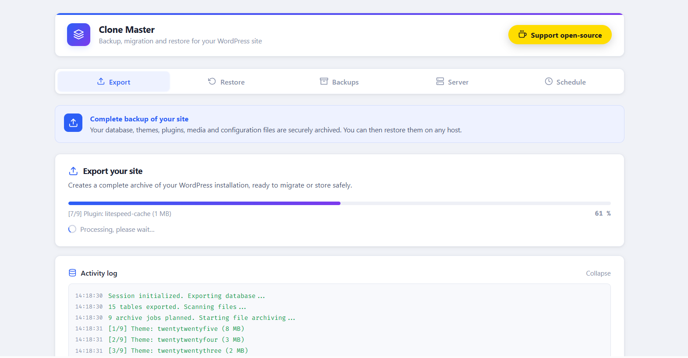
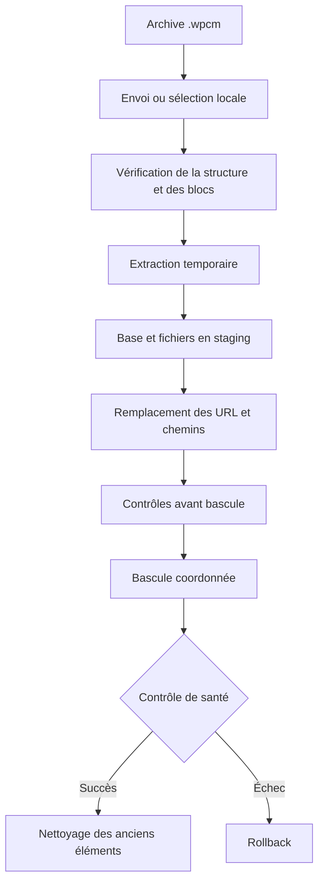

<div align="center">

# Clone Master

### Sauvegarde, migration et restauration WordPress avec validation avant bascule

**Créez des archives `.wpcm` reprenables, préparez la restauration à l'écart du site actif et gardez une voie de récupération lorsque WordPress ne démarre plus.**

<br>


<br>

[Comprendre le plugin](#pourquoi-clone-master) ·
[Créer une sauvegarde](#créer-une-sauvegarde-wordpress) ·
[Restaurer ou migrer](#restaurer-ou-migrer-un-site-wordpress) ·
[Utiliser WP-CLI](#wp-cli-et-environnement-de-secours) ·
[Signaler un problème](https://github.com/Assistouest/wp-clone-master/issues)

</div>

---

Clone Master est un plugin de sauvegarde WordPress conçu pour les migrations, les restaurations contrôlées et les situations dans lesquelles une opération peut être interrompue par le serveur, le navigateur ou le réseau.

Le plugin exporte la base de données et le contenu du site dans une archive native `.wpcm`. Il vérifie les blocs écrits, reprend les opérations interrompues et prépare la restauration dans une zone temporaire avant de modifier les tables et fichiers utilisés par le site.

<p align="center">
  
</p>

> [!IMPORTANT]
> Une sauvegarde conservée uniquement sur le serveur du site ne constitue pas une stratégie suffisante. Téléchargez chaque archive importante ou envoyez-la vers un stockage distinct, puis testez périodiquement son extraction ou sa restauration.

## Pourquoi Clone Master

Une restauration ne devrait pas commencer par écraser le site qu'elle est censée remettre en service.

Clone Master sépare la préparation de la bascule. L'archive est d'abord reçue et contrôlée, la base est importée sous un préfixe temporaire, les fichiers sont préparés sur le même système de fichiers et les remplacements d'URL sont appliqués avant la promotion finale. Le site en place reste disponible tant que les contrôles préalables ne sont pas terminés.

Cette approche répond à plusieurs problèmes fréquents des sauvegardes WordPress : les limites d'exécution PHP, les archives volumineuses, les connexions instables, les données sérialisées, les changements de domaine et les interruptions au moment le plus sensible d'une restauration.

| Besoin | Réponse apportée par Clone Master |
|---|---|
| Sauvegarder un site WordPress | Création d'une archive `.wpcm` contenant la base et les éléments pris en charge sous `wp-content/` |
| Migrer vers un autre hébergement | Import dans une zone de préparation avant la bascule vers le site de destination |
| Changer de domaine ou passer en HTTPS | Remplacement des URL dans les chaînes, le JSON et les données PHP sérialisées valides |
| Reprendre une opération interrompue | États persistants, curseurs authentifiés et envois découpés reprenant au dernier point validé |
| Contrôler une archive sans restaurer | Inspection, vérification complète et extraction disponibles dans WordPress, avec WP-CLI ou avec l'outil autonome |
| Importer une sauvegarde pour plus tard | Mode **Store only** qui vérifie puis ajoute l'archive aux sauvegardes locales sans modifier le site |
| Revenir à l'état précédent | Journal de bascule, contrôle de santé et rollback coordonné en cas d'échec final |

## Créer une sauvegarde WordPress

Depuis l'administration, ouvrez **Clone Master**, consultez les informations du serveur puis lancez un export manuel. Le moteur traite la base et les fichiers par étapes afin de rester compatible avec les hébergements qui imposent des temps d'exécution courts.

Une fois l'archive publiée, elle est disponible dans le dossier local suivant :

```text
wp-content/wpcm-backups/
```

Le nom du fichier indique le site, le type de sauvegarde et sa date de création :

```text
monsite.fr-backup-manual-20260725T183500-a1b2c3d4e5f6.wpcm
monsite.fr-backup-auto-20260725T183500-a1b2c3d4e5f6.wpcm
```

Les sauvegardes manuelles et planifiées utilisent le même moteur. La planification prend en charge les fréquences horaire, deux fois par jour, quotidienne, hebdomadaire et mensuelle. La rétention peut être définie par nombre d'archives ou par ancienneté, tandis que les sauvegardes manuelles ne sont pas supprimées par la rétention automatique.

Clone Master peut conserver les fichiers localement ou envoyer les sauvegardes terminées vers un serveur Nextcloud configuré par l'administrateur. Il est possible de garder ou de supprimer la copie locale après un transfert validé, et d'envoyer une notification par e-mail après chaque opération ou uniquement en cas d'erreur.

## Ce que contient une archive `.wpcm`

Le conteneur `WPCMARCHIVE2` contient une entrée `database.sql` et les fichiers sélectionnés sous `wp-content/`. Selon le site, cela peut inclure les extensions, les thèmes, les médias, les extensions indispensables, les fichiers de langue et les tables WordPress utilisant le préfixe du site.

Clone Master n'embarque pas le coeur WordPress dans l'archive. Il exclut également ses propres fichiers temporaires ainsi que les emplacements identifiés comme des dépôts de sauvegardes produits par d'autres outils. Cette protection évite de créer une sauvegarde qui contient d'autres sauvegardes et dont la taille augmente à chaque export.

Les fichiers de configuration serveur tels que `.htaccess`, `.user.ini`, `php.ini` et `wp-config.php` ne sont pas restaurés automatiquement. Leur gestion reste séparée afin d'éviter d'appliquer une configuration propre à l'ancien hébergement sur le nouveau serveur.

## Un format conçu pour reprendre après une interruption

Une archive `.wpcm` est construite en ajoutant les données à la suite des blocs déjà validés. Les octets finalisés ne sont pas réécrits à chaque étape. Chaque bloc possède une empreinte SHA-256 et le pied de l'archive authentifie le contenu qui le précède.

Lorsqu'une création, un envoi ou une extraction est interrompu, Clone Master reprend depuis un état persistant associé à l'opération. Le moteur vérifie que la source n'a pas changé avant de continuer et refuse de reprendre avec un état appartenant à une autre archive.

La publication finale utilise des fichiers temporaires placés dans le même dossier que leur destination, suivis d'un renommage. Des verrous non bloquants empêchent deux processus de modifier simultanément la même sauvegarde ou la même session.

<details>
<summary><strong>Voir les principaux mécanismes d'intégrité</strong></summary>

<br>

Le moteur associe plusieurs contrôles plutôt qu'un unique test effectué à la fin :

- empreinte SHA-256 de chaque bloc compressé ;
- empreinte du contenu portée par le pied de l'archive ;
- empreinte SHA-256 du fichier publié lorsqu'elle est disponible ;
- journal durable protégé par HMAC avec numéros de séquence monotones ;
- emplacements de récupération alternés pour conserver un état précédent exploitable ;
- écriture temporaire et publication atomique par renommage ;
- vérification de la taille, de la structure et des sommes de contrôle avant extraction ou stockage.

</details>

## Restaurer ou migrer un site WordPress

La restauration commence par une analyse de l'archive et par la préparation de son contenu. La base de données n'est pas importée directement dans les tables actives. Clone Master crée des tables de staging, contrôle leur structure, leur volume, les valeurs sérialisées et les remplacements nécessaires, puis prépare la transition.

La bascule de la base utilise une instruction MySQL `RENAME TABLE` portant sur l'ensemble des tables concernées. Les fichiers sont promus par renommage sur le même système de fichiers et chaque changement est inscrit dans un journal de rollback signé. Un contrôle de santé est exécuté avant la suppression de l'ancien état.



Pour une migration, installez d'abord WordPress et Clone Master sur le serveur de destination. Importez ensuite l'archive, vérifiez l'URL cible et laissez le plugin terminer la préparation avant d'autoriser la bascule.

> [!WARNING]
> Une sauvegarde découpée en plusieurs requêtes ne peut pas représenter une transaction unique couvrant toute l'activité d'une base très sollicitée. Pour une boutique, un espace membre, un site de réservation ou un site recevant de nombreux formulaires, prévoyez une fenêtre de maintenance pendant la sauvegarde finale et la restauration.

## Importer une archive sans restaurer le site

Le mode **Store only** répond à un besoin différent de la restauration. Il permet d'envoyer une archive `.wpcm` vers un site, de la vérifier intégralement puis de l'ajouter à la bibliothèque locale des sauvegardes.

La base de données et les fichiers du site courant restent inchangés. Le plugin ne décompresse pas l'ensemble du contenu dans une arborescence de restauration. Après validation, l'archive est publiée atomiquement avec un nom protégé contre les collisions et un fichier d'empreinte `.sha256` lorsque le calcul est disponible.

Ce mode convient notamment pour centraliser une archive sur le serveur de destination avant une intervention, conserver une sauvegarde client dans Clone Master ou vérifier qu'un fichier transféré peut être relu avant de programmer la restauration.

## WP-CLI et environnement de secours

Clone Master ajoute un onglet **Recovery** dans l'administration. Il affiche des commandes prêtes à copier avec les chemins du site, du dossier de sauvegarde et de l'outil de récupération propres à l'installation.

### Lorsque WordPress peut encore démarrer

Le plugin enregistre une arborescence de commandes WP-CLI sous `clone-master`. L'alias plus court `wpcm` exécute les mêmes opérations.

```bash
# Créer une sauvegarde avec le même moteur que l'administration
wp clone-master backup create

# Créer la sauvegarde et la copier vers un autre emplacement local
wp clone-master backup create --copy-to=/srv/backups/client.wpcm

# Lister les archives locales
wp clone-master backup list --format=table

# Lire l'inventaire authentifié d'une archive
wp clone-master archive info backup.wpcm --format=json

# Vérifier la structure, le manifeste et le pied de l'archive
wp clone-master archive verify backup.wpcm --quick

# Vérifier tous les blocs et les sommes de contrôle
wp clone-master archive verify backup.wpcm

# Vérifier puis extraire vers un dossier vide
wp clone-master archive extract backup.wpcm /srv/recovery/client

# Afficher le chemin et l'utilisation de l'outil autonome
wp clone-master recovery-kit
```

Le nom d'une archive présente dans `wp-content/wpcm-backups/` peut être utilisé directement. Un chemin absolu vers une autre archive `.wpcm` est également accepté. La commande d'extraction écrit `database.sql` et `wp-content/` dans un dossier vide, conserve un point de reprise local et continue après une interruption.

Les mêmes commandes sont disponibles avec l'alias :

```bash
wp wpcm backup create
wp wpcm archive verify backup.wpcm
wp wpcm archive extract backup.wpcm /srv/recovery/client
```

### Lorsque WordPress, un thème ou une extension empêche le démarrage

Clone Master publie automatiquement un kit autonome à côté des sauvegardes locales :

```text
wp-content/wpcm-backups/recovery-kit/wpcm-recovery.php
```

Ce script s'exécute avec PHP en ligne de commande. Il ne charge ni WordPress, ni les extensions, ni le thème. Il reste donc utilisable après une erreur fatale survenant avant l'initialisation de l'administration ou de WP-CLI.

```bash
# Inspecter le manifeste et l'inventaire
php wp-content/wpcm-backups/recovery-kit/wpcm-recovery.php info /srv/backups/site.wpcm

# Vérifier chaque bloc et chaque somme de contrôle
php wp-content/wpcm-backups/recovery-kit/wpcm-recovery.php verify /srv/backups/site.wpcm

# Vérifier puis extraire vers un dossier vide
php wp-content/wpcm-backups/recovery-kit/wpcm-recovery.php extract /srv/backups/site.wpcm /srv/recovery/site
```

Ajoutez `--json` à l'une de ces commandes pour obtenir une sortie exploitable par un script :

```bash
php wp-content/wpcm-backups/recovery-kit/wpcm-recovery.php verify /srv/backups/site.wpcm --json
```

> [!CAUTION]
> L'outil autonome extrait et vérifie la sauvegarde, mais ne remplace pas automatiquement le site en production. Cette séparation permet d'examiner les fichiers et les chemins avant une importation de base ou une copie de fichiers.

Après extraction, la récupération manuelle peut s'appuyer sur les commandes suivantes. Adaptez les chemins, contrôlez le préfixe des tables et lancez toujours `rsync` avec `--dry-run` avant la copie :

```bash
wp --path=/var/www/html db import /srv/recovery/site/database.sql --skip-plugins --skip-themes
rsync -a --dry-run /srv/recovery/site/wp-content/ /var/www/html/wp-content/
rsync -a /srv/recovery/site/wp-content/ /var/www/html/wp-content/
```

## Données sérialisées et remplacement des URL

WordPress et de nombreuses extensions enregistrent des tableaux ou des objets sous une forme sérialisée. La longueur de chaque chaîne fait partie de la valeur :

```text
s:24:"https://ancien-site.fr";
```

Un remplacement SQL direct peut modifier l'URL sans recalculer cette longueur, ce qui rend ensuite la donnée illisible par PHP. Clone Master analyse les valeurs complètes avec un parseur qui n'autorise pas l'instanciation de classes, applique les changements de manière récursive, recalcule les longueurs en octets puis valide le résultat.

Une chaîne qui ressemble seulement au début d'une valeur sérialisée, par exemple un extrait tronqué ou une ligne de journal, reste traitée comme du texte. Le moteur prend également en charge les chaînes simples et les structures JSON utilisées par WordPress et ses extensions.

## Conservation exacte du caractère `%`

Le caractère `%` possède plusieurs significations dans WordPress, les extensions SEO et les URL encodées :

```text
/%postname%/
%%title%%
58%
https://example.com/fichier%20avec%20espace
```

Clone Master n'effectue pas de remplacement global de `%` dans le dump SQL. Les structures de permaliens, les modèles SEO, les pourcentages et les URL encodées sont conservés. Le moteur refuse également de persister un placeholder temporaire non restauré correspondant à une séquence de 64 caractères hexadécimaux entre accolades.

## Sauvegarde distante sur Nextcloud

Le stockage Nextcloud est facultatif et cible le serveur WebDAV choisi par l'administrateur. Le mot de passe d'application est enregistré avec un chiffrement authentifié AES-256-GCM dérivé des clés WordPress du site.

Les requêtes sont limitées aux adresses publiques, les redirections sont désactivées et les transferts sont effectués en streaming afin d'éviter de charger une archive complète en mémoire. Lorsque l'environnement cURL le permet, la connexion utilise l'adresse DNS préalablement validée pour réduire les risques de changement de destination entre la validation et le transfert.

Clone Master ne contacte aucun service de stockage imposé par l'éditeur. Les requêtes sortantes sont déclenchées uniquement lorsque Nextcloud est configuré par un administrateur.

## Installation

1. Téléchargez ou clonez le dépôt dans `wp-content/plugins/clone-master/`.
2. Activez **Clone Master** depuis l'administration WordPress.
3. Ouvrez l'écran **Server** et contrôlez l'espace disque, la mémoire PHP, la taille maximale d'envoi et les extensions requises.
4. Lancez une première sauvegarde manuelle et téléchargez l'archive obtenue.
5. Configurez ensuite la planification, la rétention, les notifications et Nextcloud selon votre politique de sauvegarde.

Sur Nginx, le plugin fonctionne sans `.htaccess`. Une règle de refus d'accès au chemin fixe des sauvegardes est proposée dans l'administration pour ajouter une protection au niveau du serveur web.

## Prérequis et compatibilité

| Composant | Prérequis ou comportement |
|---|---|
| WordPress | Version 5.6 ou plus récente, testé jusqu'à WordPress 7.0 |
| PHP | Version 7.4 ou plus récente |
| Extensions PHP | MySQLi, JSON, zlib et OpenSSL |
| Base de données | MySQL ou MariaDB |
| Serveur web | Compatible avec Apache, Nginx et LiteSpeed sans dépendre de `fastcgi_finish_request()` |
| WP-CLI | Facultatif pour l'interface, recommandé pour l'automatisation et la récupération |
| Espace disque | Suffisant pour l'archive, la zone temporaire, le staging et l'ancien état conservé pendant la bascule |

Le moteur natif `.wpcm` ne dépend pas d'une extension PHP générique de création d'archives.

## Limites à connaître

Les tables possédant une clé primaire ou une clé `UNIQUE NOT NULL` peuvent être exportées avec des curseurs reprenables. Pour les tables non vides qui ne disposent pas d'une telle clé, Clone Master tente de créer un instantané auxiliaire avec un curseur synthétique, puis utilise un mode de repli limité par la mémoire si les droits nécessaires ne sont pas disponibles.

Les vues et déclencheurs utilisant le préfixe WordPress sont refusés, car leur restauration transactionnelle exigerait une gestion de dépendances qui n'est pas incluse dans cette version.

La réussite d'une sauvegarde ne remplace pas un test de récupération. Vérifiez régulièrement une archive avec WP-CLI ou le kit autonome et réalisez des restaurations de contrôle dans un environnement distinct.

## Diagnostics et demande d'aide

Les opérations produisent des diagnostics persistants avec un identifiant de requête. En cas d'échec, conservez cet identifiant et exportez le journal depuis l'écran **Diagnostics** avant de nettoyer la session.

Pour signaler un problème, utilisez les [issues GitHub](https://github.com/Assistouest/wp-clone-master/issues) en indiquant la version de Clone Master, WordPress, PHP, le serveur web, le moteur de base de données et l'étape concernée.

Ne joignez jamais à une issue publique une archive `.wpcm`, un fichier `wp-config.php`, un mot de passe, un jeton Nextcloud, des cookies d'administration ou des données personnelles.

## Confidentialité

Clone Master ne contient ni mesure d'audience, ni publicité, ni télémétrie, ni suivi utilisateur. Une connexion externe est effectuée uniquement lorsque l'administrateur configure Nextcloud, et elle cible le serveur renseigné dans les réglages.

## Licence

Clone Master est distribué sous licence **GPL-2.0-or-later**. Consultez le fichier [`LICENSE`](LICENSE) pour le texte complet de la licence.

## Gérer un parc de sites WordPress

Clone Master intervient au niveau d'un site pour la sauvegarde, la migration et la récupération. Pour centraliser les mises à jour, la sécurité, la disponibilité, les performances et les rapports clients d'un parc WordPress, découvrez WP Commander.

<div align="center">

### [Gérer plusieurs sites WordPress depuis un seul tableau de bord](https://wpcommander.fr/)

Supervisez les sites de vos clients, traitez les actions prioritaires et produisez les preuves de votre maintenance depuis un espace conçu pour les agences WordPress.

</div>
